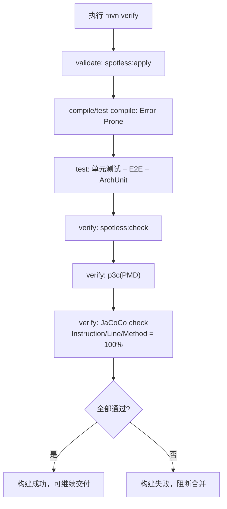

# Spring Boot 项目生成器

一个基于 `Java + FreeMarker` 的 Spring Boot 脚手架生成器。  
目标是生成“开箱即跑、质量门禁默认开启”的标准项目骨架，并把示例业务统一标记为 `Demo*`，便于后续替换。

## 1. 功能概览

### 1.1 固定内容（默认生成）

- 标准分层包结构：`config/controller/service/repository/entity/dto/vo/exception/common/util/aspect/annotation/proxy`
- `DemoUser` 示例 CRUD（类名统一 `Demo*` 前缀）
- PostgreSQL + Flyway（默认迁移脚本：`V1__create_demo_users_table.sql`）
- `BaseEntity` 审计字段：`created_at/created_by/updated_at/updated_by`
- 测试基座：单元测试 + E2E + ArchUnit + PostgreSQL 测试库清理
- 质量门禁：Spotless、Error Prone、p3c、JaCoCo（3 维度 100%）

### 1.2 可选模块（按需生成）

- `redis`
- `pulsar-producer`
- `pulsar-consumer`

通过 `--modules` 指定，例如：`--modules redis,pulsar-producer`。

## 2. 快速开始

### 2.1 构建生成器

```bash
mvn -q -DskipTests package
```

产物：

- `target/java-proj-gen-0.1.0.jar`

### 2.2 查看命令帮助

```bash
java -jar target/java-proj-gen-0.1.0.jar --help
# 或
java -jar target/java-proj-gen-0.1.0.jar -h
```

### 2.3 生成项目

```bash
java -jar target/java-proj-gen-0.1.0.jar \
  --project-name demo-service \
  --group-id com.acme \
  --artifact-id demo-service \
  --package-name com.acme.demoservice \
  --boot-version 3.2.12 \
  --boot-line 3.2 \
  --modules redis,pulsar-producer \
  --p3c-mode strict \
  --output ./output
```

参数说明：

- `--boot-line`：限制 Spring Boot 大版本线，`*` 表示不校验版本线
- `--p3c-mode`：`strict|advisory|off`，默认 `strict`

### 2.4 生成后运行与验证

先准备本地 PostgreSQL（包含测试库）：

```bash
docker run -d --name local-postgres \
  -e POSTGRES_USER=postgres \
  -e POSTGRES_PASSWORD=postgres \
  -e POSTGRES_DB=postgres \
  -p 5432:5432 postgres:16-alpine

docker exec -i local-postgres psql -U postgres -d postgres \
  -c "CREATE DATABASE postgres_test;" || true
```

进入生成项目执行：

```bash
cd output/demo-service
mvn verify
mvn spring-boot:run
```

如需自定义测试库连接：

```bash
export TEST_DB_URL=jdbc:postgresql://localhost:5432/postgres_test
export TEST_DB_USERNAME=postgres
export TEST_DB_PASSWORD=postgres
```

## 3. 如何保证代码质量

### 3.1 质量门禁流程图



### 3.2 质量门禁清单

| 维度 | 工具/插件 | 触发阶段 | 默认策略 |
| --- | --- | --- | --- |
| 代码风格 | Spotless + google-java-format | `validate` + `verify` | 强制统一格式 |
| 编译期静态检查 | Error Prone (`2.42.0`) | `compile/test-compile` | 命中问题直接失败 |
| Java 规约 | p3c (`maven-pmd-plugin` + `p3c-pmd`) | `verify` | 默认 strict（失败阻断） |
| 架构约束 | ArchUnit | `test` | 分层/命名违规失败 |
| 覆盖率 | JaCoCo | `verify` | `INSTRUCTION/LINE/METHOD = 1.00` |
| 功能正确性 | 单元测试 + E2E | `test` | 测试失败即失败 |

### 3.3 协作中的强制策略

- 默认使用 `mvn verify` 作为合并前检查入口
- 风格不靠约定，靠 Spotless 自动修正 + 校验
- 规约与覆盖率不是 advisory，默认都是门禁（strict）
- 生成项目自带 `.mvn/jvm.config`，保证 JDK17 下 Error Prone 可运行

## 4. Maven 插件基线

默认启用：

- `org.springframework.boot:spring-boot-maven-plugin`
- `org.apache.maven.plugins:maven-compiler-plugin`（含 Error Prone）
- `com.diffplug.spotless:spotless-maven-plugin`
- `org.jacoco:jacoco-maven-plugin`
- `org.apache.maven.plugins:maven-pmd-plugin` + `com.alibaba.p3c:p3c-pmd`
- `com.tngtech.archunit:archunit-junit5`（测试依赖）

触发时机：

- Spotless：`validate -> apply`，`verify -> check`
- Error Prone：`compile/test-compile`
- p3c：`verify -> pmd:check`
- JaCoCo：`prepare-agent` + `verify(report/check)`
- ArchUnit：随测试执行

## 5. p3c 模式与开关

### 5.1 模式差异

| 模式 | 配置 | 结果 |
| --- | --- | --- |
| `strict`（默认） | `failOnViolation=true` | 命中违规即失败 |
| `advisory` | `failOnViolation=false` | 输出违规但不因 p3c 失败 |
| `off` | `skip=true` | 跳过 p3c |

### 5.2 脚手架参数（生成时设默认）

```bash
java -jar target/java-proj-gen-0.1.0.jar ... --p3c-mode strict
java -jar target/java-proj-gen-0.1.0.jar ... --p3c-mode advisory
java -jar target/java-proj-gen-0.1.0.jar ... --p3c-mode off
```

### 5.3 生成后切换

```bash
mvn verify
mvn verify -Pp3c-advisory
mvn verify -Pp3c-strict
mvn verify -Pp3c-off

# 属性覆盖
mvn verify -Dp3c.failOnViolation=true
mvn verify -Dp3c.failOnViolation=false
mvn verify -Dp3c.skip=true
```

### 5.4 排除与白名单

目录/文件排除：

```xml
<excludes>
  <exclude>**/generated/**</exclude>
  <exclude>**/legacy/**</exclude>
</excludes>
<excludeRoots>
  <excludeRoot>${project.basedir}/target/generated-sources</excludeRoot>
  <excludeRoot>${project.basedir}/target/generated-test-sources</excludeRoot>
</excludeRoots>
```

白名单文件：

```xml
<excludeFromFailureFile>${project.basedir}/config/pmd-exclude.properties</excludeFromFailureFile>
```

示例：

```properties
com.acme.legacy.LegacyService=UnusedPrivateField,EmptyCatchBlock
com.acme.legacy.LegacyDto=BooleanPropertyShouldNotStartWithIsRule
```

## 6. 官方文档来源

- Spring Boot Maven Plugin: [官方文档](https://docs.spring.io/spring-boot/docs/current/maven-plugin/reference/htmlsingle/)
- Maven Compiler Plugin: [官方文档](https://maven.apache.org/plugins/maven-compiler-plugin/)
- Error Prone: [官方文档](https://errorprone.info/docs/installation)
- Spotless Maven Plugin: [官方文档](https://github.com/diffplug/spotless/tree/main/plugin-maven)
- google-java-format: [官方仓库](https://github.com/google/google-java-format)
- JaCoCo Maven Plugin: [官方文档](https://www.jacoco.org/jacoco/trunk/doc/maven.html)
- Maven PMD Plugin: [官方文档](https://maven.apache.org/plugins/maven-pmd-plugin/)
- PMD 规则集与抑制: [规则集文档](https://docs.pmd-code.org/latest/pmd_userdocs_making_rulesets.html), [抑制文档](https://docs.pmd-code.org/latest/pmd_userdocs_suppressing_warnings.html)
- ArchUnit: [官方文档](https://www.archunit.org/)
- Alibaba p3c: [官方仓库](https://github.com/alibaba/p3c), [p3c-pmd 说明](https://github.com/alibaba/p3c/blob/master/p3c-pmd/README.md)
